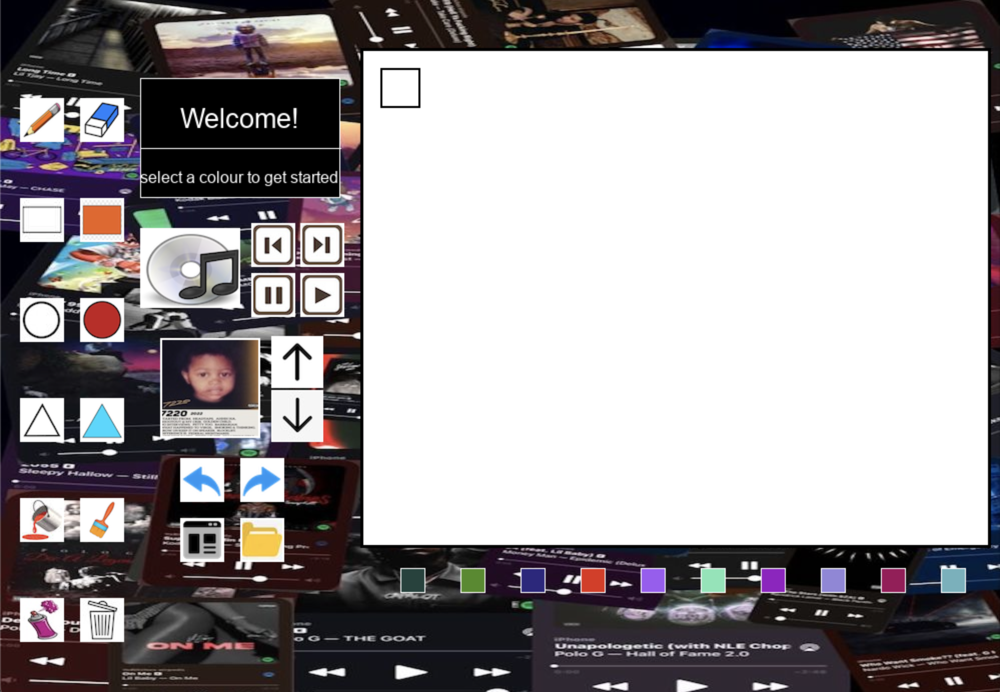

# 🎨 Paint – Python Drawing App

This is a custom Paint application built using **Pygame** and **Tkinter**, created as my very first Python project in Grade 11 Computer Science.

The program lets users draw on a canvas using different tools, pick colors, use stamps, and even add music—all while learning how graphical user interfaces work behind the scenes.

---

## ✨ Features

- 🖊️ Pencil, rectangle, circle, hexagon, spray, and fill tools
- 🎨 Color palette and color preview
- 🧽 Eraser functionality
- 🖼️ Stamps and image uploads
- ⏮️ Undo and Redo history
- 🎵 Music button
- 📂 File upload using Tkinter's file dialog
- 📏 Clean layout with a drawing canvas and tool selection area

---

## 💻 Technologies Used

- **Python 3**
- **Pygame** – for graphics and UI
- **Tkinter** – for file selection

---

## ▶️ How to Run

1. Make sure Python is installed: [Download Python](https://www.python.org/downloads/)
2. Install Pygame if you haven't already:
```bash
pip install pygame
```
3. Save or clone this project folder.
4. Run the program in your terminal or IDE:
```bash
python Paint.py
```
Note: You should have fullscreenpicture.jpg in the same directory for the background to load properly.

---

## 🧠 What I Learned

- How to build a graphical user interface from scratch

- How to handle events like mouse clicks and keyboard presses

- How to organize different drawing tools and functionality

- How to use libraries like pygame and tkinter in real-world projects

---

## 📸 Screenshot

Here's what the Paint app looks like while running:


